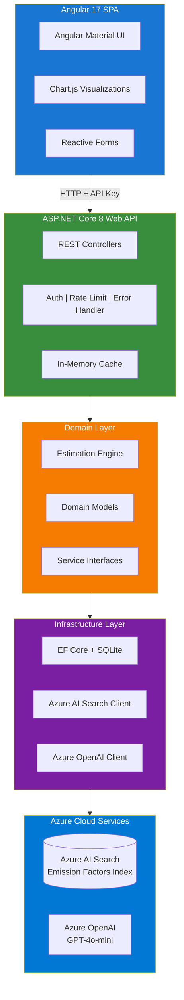
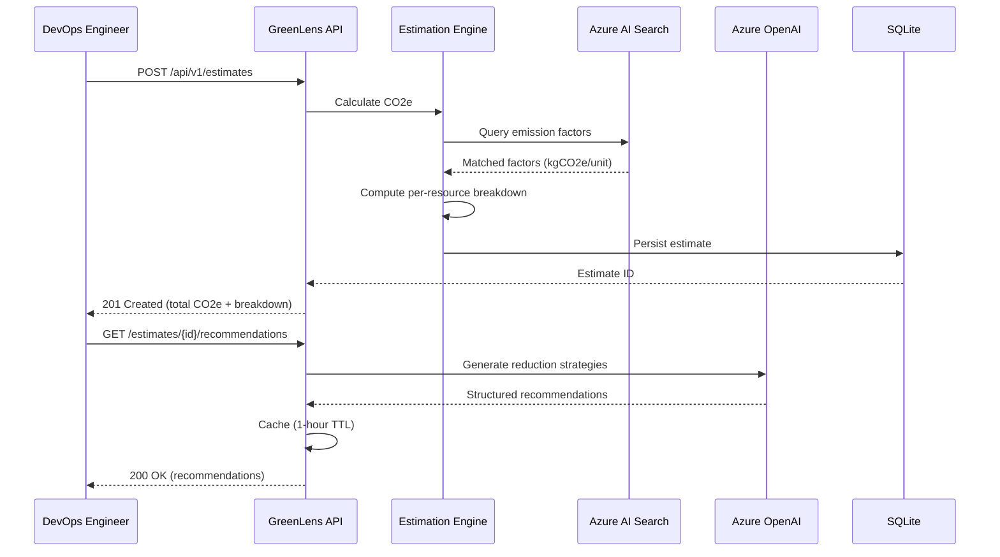
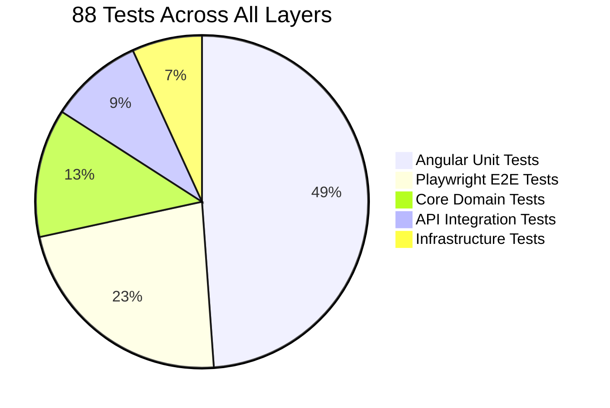

# GreenLens

AI-powered cloud carbon footprint estimation for Azure infrastructure. Submit your resource usage — get CO2e estimates, per-resource breakdowns, and actionable reduction recommendations powered by Azure OpenAI.

**[Live Demo](https://greenlens-api.azurewebsites.net)** | **[Swagger API](https://greenlens-api.azurewebsites.net/swagger)**

[](https://github.com/soneeee22000/GreenLens.dev/actions/workflows/ci.yml)
[](https://github.com/soneeee22000/GreenLens.dev)
[](https://github.com/soneeee22000/GreenLens.dev)
[](https://github.com/soneeee22000/GreenLens.dev)
[](https://dotnet.microsoft.com/)
[](https://angular.io/)
[](https://learn.microsoft.com/en-us/dotnet/csharp/)
[](https://www.typescriptlang.org/)
[](https://azure.microsoft.com/)
[](https://opensource.org/licenses/MIT)

[Live Demo](https://greenlens-api.azurewebsites.net) | [Architecture](#architecture) | [API Reference](#api-endpoints) | [Tech Stack](#tech-stack) | [Getting Started](#quick-start) | [Test Coverage](#test-coverage) | [Engineering Decisions](#key-engineering-decisions)

---

## Why GreenLens?

The EU Corporate Sustainability Reporting Directive (CSRD) mandates Scope 3 emissions reporting starting 2026. Cloud infrastructure is a growing portion of enterprise carbon footprint, yet existing tools are delayed, high-level, and lack actionable insights. GreenLens fills that gap with a sub-500ms API that returns precise CO2e estimates and AI-generated reduction strategies.

---

## Architecture



**Clean Architecture** with strict dependency inversion: `Api -> Core <- Infrastructure`. The domain layer owns interfaces; infrastructure implements them. No Azure SDK leaks into business logic.

---

## Request Flow



---

## Tech Stack

| Layer         | Technology                                                  | Purpose                                                     |
| ------------- | ----------------------------------------------------------- | ----------------------------------------------------------- |
| **Frontend**  | Angular 17, TypeScript (strict), Angular Material, Chart.js | SPA with dashboard, forms, and data visualization           |
| **Backend**   | ASP.NET Core 8, C# 12                                       | REST API with middleware pipeline                           |
| **Domain**    | Clean Architecture, CQRS-lite                               | Business logic isolation                                    |
| **AI/Search** | Azure AI Search, Azure OpenAI (GPT-4o-mini)                 | Semantic emission factor lookup + reduction recommendations |
| **Database**  | EF Core 8 + SQLite (dev) / Azure SQL (prod)                 | Estimate persistence with migrations                        |
| **Testing**   | xUnit, Moq, Jasmine/Karma, Playwright                       | 88 tests across unit, integration, and E2E                  |
| **DevOps**    | Docker, GitHub Actions, Swagger/OpenAPI                     | Containerized builds, CI pipeline, auto-generated API docs  |

---

## API Endpoints

| Method | Endpoint                                 | Purpose                                          | Auth    |
| ------ | ---------------------------------------- | ------------------------------------------------ | ------- |
| `GET`  | `/health`                                | Health check                                     | None    |
| `GET`  | `/api/v1/regions`                        | List 15 Azure regions with grid carbon intensity | None    |
| `POST` | `/api/v1/estimates`                      | Create carbon footprint estimate                 | API Key |
| `GET`  | `/api/v1/estimates`                      | List estimates (paginated)                       | API Key |
| `GET`  | `/api/v1/estimates/{id}`                 | Get estimate with per-resource breakdown         | API Key |
| `GET`  | `/api/v1/estimates/{id}/recommendations` | AI-powered reduction recommendations             | API Key |
| `GET`  | `/api/v1/emission-factors/search`        | Semantic search across emission factors          | API Key |

### Example: Create Estimate

```bash
curl -X POST https://localhost:5001/api/v1/estimates \
  -H "Content-Type: application/json" \
  -H "X-Api-Key: your-key" \
  -d '{
    "resources": [
      { "resourceType": "Standard_D4s_v3", "region": "westeurope", "quantity": 2, "hours": 720 },
      { "resourceType": "BlobStorage", "region": "westeurope", "quantity": 500, "hours": 720 }
    ]
  }'
```

### Example Response

```json
{
  "data": {
    "estimateId": "a1b2c3d4-e5f6-7890-abcd-ef1234567890",
    "totalCo2eKg": 12.35,
    "createdAt": "2026-03-05T10:00:00Z",
    "breakdown": [
      {
        "resourceType": "Standard_D4s_v3",
        "region": "westeurope",
        "quantity": 2,
        "hours": 720,
        "co2eKg": 8.12,
        "co2ePerUnit": 0.00564,
        "unit": "kgCO2e/hour"
      },
      {
        "resourceType": "BlobStorage",
        "region": "westeurope",
        "quantity": 500,
        "hours": 720,
        "co2eKg": 4.23,
        "co2ePerUnit": 0.00586,
        "unit": "kgCO2e/GB-month"
      }
    ]
  },
  "error": null
}
```

---

## Project Structure

```
GreenLens/
├── src/
│   ├── GreenLens.Api/              # Controllers, middleware, DI configuration
│   ├── GreenLens.Core/             # Domain models, interfaces, estimation engine
│   ├── GreenLens.Infrastructure/   # EF Core repos, Azure AI Search, Azure OpenAI
│   ├── GreenLens.Shared/           # DTOs, API contracts, constants
│   └── greenlens-ui/               # Angular 17 SPA
│       ├── src/app/components/     # Dashboard, EstimateForm, EstimateDetail, Search
│       ├── src/app/services/       # Typed HTTP client for all API endpoints
│       └── e2e/                    # Playwright E2E tests (20 tests)
├── tests/
│   ├── GreenLens.Core.Tests/       # 11 unit tests (estimation engine, domain logic)
│   ├── GreenLens.Api.Tests/        # 8 integration tests (endpoints, middleware)
│   └── GreenLens.Infrastructure.Tests/ # 6 tests (repositories, Azure service mocks)
├── tools/
│   └── GreenLens.Seed/             # CLI to seed emission factors into Azure AI Search
├── docs/
│   └── PRD.md                      # Product requirements document
├── .github/workflows/ci.yml        # CI: build, test, format, Docker
├── Dockerfile                      # Multi-stage build, non-root user
├── docker-compose.yml              # Local dev orchestration
└── GreenLens.sln
```

---

## Test Coverage



| Layer          | Framework                     | Count | Covers                                           |
| -------------- | ----------------------------- | ----- | ------------------------------------------------ |
| Domain         | xUnit + Moq                   | 11    | Estimation engine, CO2e calculations, edge cases |
| API            | xUnit + WebApplicationFactory | 8     | Endpoint contracts, auth, error responses        |
| Infrastructure | xUnit + Moq                   | 6     | Repository CRUD, Azure service integration       |
| Frontend       | Jasmine + Karma               | 43    | All components, services, form validation        |
| E2E            | Playwright                    | 20    | Full user flows with API mocking                 |

---

## Quick Start

### Prerequisites

- [.NET 8 SDK](https://dotnet.microsoft.com/download/dotnet/8.0)
- [Node.js 20+](https://nodejs.org/) (for Angular frontend)
- Azure account (for AI Search + OpenAI services)

### Backend

```bash
git clone git@github.com:soneeee22000/GreenLens.dev.git
cd GreenLens
cp .env.example .env    # Add your Azure credentials
dotnet restore
dotnet ef database update --project src/GreenLens.Infrastructure --startup-project src/GreenLens.Api
dotnet run --project src/GreenLens.Api
```

API at `https://localhost:5001` | Swagger at `https://localhost:5001/swagger`

### Frontend

```bash
cd src/greenlens-ui
npm install
ng serve
```

Angular app at `http://localhost:4200`

### Docker

```bash
docker compose up --build
```

### Run All Tests

```bash
# Backend (25 tests)
dotnet test

# Frontend unit tests (43 tests)
cd src/greenlens-ui && ng test --watch=false --browsers=ChromeHeadless

# E2E tests (20 tests)
cd src/greenlens-ui && npm run e2e
```

---

## Key Engineering Decisions

| Decision                                     | Rationale                                                               |
| -------------------------------------------- | ----------------------------------------------------------------------- |
| Clean Architecture over MVC                  | Domain logic is testable in isolation; Azure services are swappable     |
| Azure AI Search for emission factors         | Semantic search over 50+ factors vs. hardcoded lookup tables            |
| GPT-4o-mini over GPT-4                       | 10x cheaper, sufficient for structured recommendation generation        |
| SQLite for dev, Azure SQL for prod           | Zero-config local development; same EF Core migrations for both         |
| API key auth over JWT                        | Simpler for DevOps tool/pipeline integration; no user sessions needed   |
| Angular Material over custom CSS             | Enterprise-standard components; accessibility built-in                  |
| Playwright over Cypress                      | Native multi-browser support; better API mocking via route interception |
| In-memory cache (1h TTL) for recommendations | Avoids redundant OpenAI calls; recommendations don't change frequently  |

---

## Environment Variables

```bash
# Azure AI Search
AZURE_SEARCH_ENDPOINT=https://<name>.search.windows.net
AZURE_SEARCH_API_KEY=<key>
AZURE_SEARCH_INDEX_NAME=emission-factors

# Azure OpenAI
AZURE_OPENAI_ENDPOINT=https://<name>.openai.azure.com/
AZURE_OPENAI_API_KEY=<key>
AZURE_OPENAI_DEPLOYMENT_NAME=gpt-4o-mini

# API Security
API_KEY=<generate-a-strong-key>

# Database
DATABASE_CONNECTION_STRING=Data Source=greenlens.db
```

---

## License

MIT

---

Built by [Pyae Sone (Seon)](https://github.com/soneeee22000)
