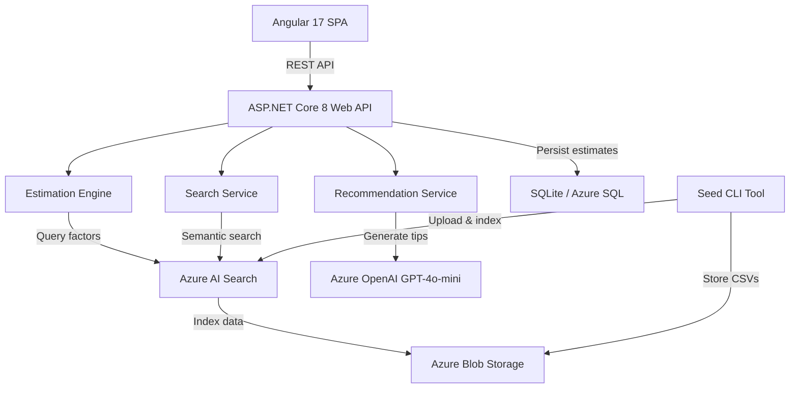

# PRD: GreenLens

> **Status:** Draft
> **Author:** Pyae Sone (Seon)
> **Date:** 2026-03-05
> **Last Updated:** 2026-03-05

---

## 1. Problem Statement

### What problem are we solving?

DevOps and Cloud Engineers have no easy way to estimate the carbon footprint of their Azure cloud infrastructure. While cloud providers publish sustainability dashboards, they are often delayed, high-level, and lack actionable recommendations. Teams need a programmatic API that takes real resource usage data (VMs, storage, compute hours, networking) and returns precise CO2e estimates with AI-powered suggestions for reducing emissions — all within their existing CI/CD and monitoring workflows.

### Who has this problem?

DevOps and Cloud Engineers managing Azure infrastructure who need to:

- Report carbon footprint for ESG compliance or internal sustainability goals
- Optimize infrastructure not just for cost, but for environmental impact
- Integrate carbon estimation into deployment pipelines and dashboards

### Why now?

EU Corporate Sustainability Reporting Directive (CSRD) mandates Scope 3 emissions reporting starting 2026. Cloud infrastructure is a growing portion of enterprise carbon footprint. Teams need tooling that integrates with their existing stack, not another dashboard to check manually.

---

## 2. Success Criteria

### Primary Metric

A DevOps engineer can submit cloud resource usage via API and receive a CO2e estimate with reduction recommendations in under 3 seconds.

### Secondary Metrics

- [ ] API response time < 500ms for estimation endpoints (95th percentile)
- [ ] Azure AI Search returns relevant emission factors in < 200ms
- [ ] 80%+ test coverage on core business logic (estimation engine)
- [ ] Swagger/OpenAPI docs auto-generated and accessible
- [ ] Angular dashboard renders estimation results with charts

### What does "done" look like?

A DevOps engineer hits the GreenLens API with their Azure resource usage (e.g., "2x Standard_D4s_v3 VMs running 720 hours in West Europe, 500GB Blob Storage"). GreenLens returns:

1. Total CO2e in kg with per-resource breakdown
2. Comparison to benchmarks (e.g., "30% above average for this workload")
3. AI-generated reduction recommendations (e.g., "Switch to B-series burstable VMs to reduce emissions by ~40%")

The Angular dashboard visualizes this data with charts and historical tracking.

---

## 3. User Stories & Acceptance Criteria

### Story 1: Estimate Carbon Footprint from Cloud Resources

**As a** DevOps engineer, **I want to** submit my Azure resource usage and get a carbon footprint estimate, **so that** I can track and report the environmental impact of my infrastructure.

**Acceptance Criteria:**

- [ ] Given valid resource usage data (VM type, hours, region, storage), when I POST to `/api/v1/estimates`, then I receive a CO2e breakdown per resource and a total in kg
- [ ] Given a region (e.g., "westeurope"), when the estimate is calculated, then the grid carbon intensity for that region is used
- [ ] Given invalid input (missing VM type, negative hours), when I POST, then I receive a 400 response with specific validation errors
- [ ] Given the estimation completes, when the response is returned, then it includes `estimateId`, `totalCo2eKg`, `breakdown[]`, and `timestamp`

### Story 2: Search Emission Factors

**As a** DevOps engineer, **I want to** search for emission factors in natural language, **so that** I can understand the carbon cost of specific Azure resources before provisioning.

**Acceptance Criteria:**

- [ ] Given a natural language query (e.g., "carbon cost of D4s VM in East US"), when I GET `/api/v1/emission-factors/search?q=...`, then I receive matching emission factors ranked by relevance
- [ ] Given a query with no matches, when I search, then I receive an empty results array with a 200 status (not an error)
- [ ] Given the Azure AI Search index is populated, when I search, then results include `resourceType`, `region`, `co2ePerHour`, `source`, and `lastUpdated`

### Story 3: Get AI-Powered Reduction Recommendations

**As a** DevOps engineer, **I want to** receive AI-generated recommendations for reducing my carbon footprint, **so that** I can take concrete action to lower emissions.

**Acceptance Criteria:**

- [ ] Given a completed carbon estimate, when I GET `/api/v1/estimates/{id}/recommendations`, then I receive 3-5 actionable recommendations
- [ ] Given each recommendation, then it includes `title`, `description`, `estimatedReductionPercent`, and `effort` (low/medium/high)
- [ ] Given the Azure OpenAI service is unavailable, when I request recommendations, then I receive a 503 with a retry-after header

### Story 4: View Dashboard with Historical Estimates

**As a** DevOps engineer, **I want to** see my estimation history on a dashboard, **so that** I can track carbon footprint trends over time.

**Acceptance Criteria:**

- [ ] Given I open the Angular dashboard, when estimates exist, then I see a line chart of total CO2e over time
- [ ] Given I click on an estimate, then I see the per-resource breakdown and recommendations
- [ ] Given no estimates exist, then I see an empty state with a prompt to create my first estimate
- [ ] Given the API is unreachable, then I see an error state with a retry button

### Story 5: Seed and Manage Emission Factor Data

**As a** system administrator, **I want to** seed the Azure AI Search index with emission factor data, **so that** the estimation engine has accurate data to work with.

**Acceptance Criteria:**

- [ ] Given EPA/cloud provider emission factor CSV files, when I run the seed command, then the data is indexed in Azure AI Search
- [ ] Given the index already has data, when I re-seed, then existing data is updated (not duplicated)
- [ ] Given the seeded data, then each record has: `resourceType`, `provider`, `region`, `co2ePerUnit`, `unit`, `source`, `effectiveDate`

---

## 4. Technical Architecture

### Stack Decision

| Layer    | Choice                              | Why                                                        |
| -------- | ----------------------------------- | ---------------------------------------------------------- |
| Frontend | Angular 17 + TypeScript             | Fills resume gap; enterprise-grade SPA framework           |
| Backend  | ASP.NET Core 8 (C#)                 | Fills resume gap; enterprise .NET experience               |
| Search   | Azure AI Search (Free tier)         | Resume gap; semantic + vector search over emission factors |
| AI       | Azure OpenAI (GPT-4o-mini)          | Cost-effective AI recommendations; existing resource       |
| Storage  | Azure Blob Storage                  | Store raw emission factor datasets                         |
| Database | SQLite (dev) / Azure SQL (prod)     | Lightweight for MVP; estimation history persistence        |
| CI/CD    | GitHub Actions                      | Standard; free for public repos                            |
| Hosting  | Local dev (Azure App Service later) | Ship API first, deploy in later phase                      |

### Architecture Diagram

### API Design (Key Endpoints)

| Method | Endpoint                                  | Purpose                                    | Auth Required |
| ------ | ----------------------------------------- | ------------------------------------------ | ------------- |
| POST   | `/api/v1/estimates`                       | Submit resource usage, get CO2e estimate   | API Key       |
| GET    | `/api/v1/estimates`                       | List estimation history                    | API Key       |
| GET    | `/api/v1/estimates/{id}`                  | Get single estimate detail                 | API Key       |
| GET    | `/api/v1/estimates/{id}/recommendations`  | Get AI reduction recommendations           | API Key       |
| GET    | `/api/v1/emission-factors/search`         | Search emission factors (natural language) | API Key       |
| GET    | `/api/v1/emission-factors/{resourceType}` | Get specific emission factor               | API Key       |
| GET    | `/api/v1/regions`                         | List supported regions with grid intensity | None          |
| GET    | `/health`                                 | Health check                               | None          |

### Data Model (Key Entities)

**CarbonEstimate**

- `Id` (Guid), `Resources[]`, `TotalCo2eKg` (decimal), `Region` (string), `CreatedAt` (DateTime)

**ResourceUsage**

- `ResourceType` (string), `Quantity` (int), `Hours` (decimal), `Region` (string), `Co2eKg` (decimal)

**EmissionFactor** (Azure AI Search index)

- `ResourceType`, `Provider`, `Region`, `Co2ePerUnit`, `Unit`, `Source`, `EffectiveDate`

**Recommendation**

- `Title`, `Description`, `EstimatedReductionPercent`, `Effort` (Low/Medium/High)

### Third-Party Dependencies

| Dependency                           | Purpose                | Risk Level | Alternative       |
| ------------------------------------ | ---------------------- | ---------- | ----------------- |
| Azure.Search.Documents               | Azure AI Search SDK    | Low        | REST API directly |
| Azure.AI.OpenAI                      | Azure OpenAI SDK       | Low        | REST API directly |
| Azure.Storage.Blobs                  | Blob storage SDK       | Low        | REST API directly |
| Microsoft.EntityFrameworkCore.Sqlite | Local DB for estimates | Low        | Dapper            |
| Swashbuckle.AspNetCore               | Swagger/OpenAPI docs   | Low        | NSwag             |
| xUnit + Moq                          | Testing                | Low        | NUnit             |

---

## 5. Edge Cases & Error Handling

### What can go wrong?

| Scenario                                   | Expected Behavior                                                                                      | Priority |
| ------------------------------------------ | ------------------------------------------------------------------------------------------------------ | -------- |
| Unknown VM type submitted                  | Return 400 with "Unsupported resource type: {type}. See /api/v1/emission-factors for supported types." | P0       |
| Azure OpenAI rate limited / unavailable    | Return cached recommendations if available; otherwise 503 with Retry-After header                      | P0       |
| Azure AI Search index empty or not ready   | Return 503 "Service initializing" during seed; return empty results after                              | P1       |
| Extremely large resource list (100+ items) | Cap at 50 resources per request; return 400 if exceeded                                                | P1       |
| Region not in emission factor database     | Return estimate with global average intensity + warning flag                                           | P1       |
| Negative or zero hours/quantity            | Validate and return 400 with specific field errors                                                     | P0       |
| Concurrent seed operations                 | Lock seed endpoint; return 409 if already running                                                      | P2       |

### Security Considerations

- [ ] Input validation on all endpoints (FluentValidation)
- [ ] API key authentication via `X-Api-Key` header
- [ ] CORS configured for Angular dev server + production domain only
- [ ] Rate limiting (100 requests/minute per API key)
- [ ] Secrets (Azure keys, connection strings) in environment variables / Azure Key Vault
- [ ] No raw Azure credentials exposed in API responses
- [ ] Parameterized queries via EF Core (no raw SQL)

---

## 6. Testing Strategy

### Unit Tests (Target: 80%+ coverage on business logic)

- [ ] CarbonEstimationService — calculate CO2e for each resource type
- [ ] EmissionFactorService — lookup and fallback logic
- [ ] Validation logic — all input validation rules
- [ ] RecommendationService — prompt construction and response parsing
- [ ] Region/grid intensity mapping

### Integration Tests

- [ ] All API endpoints (happy path + error cases)
- [ ] Azure AI Search queries (with test index)
- [ ] Azure OpenAI integration (with mocked responses)
- [ ] EF Core database operations (SQLite in-memory)
- [ ] Seed pipeline end-to-end

### E2E Tests (Critical Paths Only)

- [ ] Submit estimate via Angular form -> see results with chart
- [ ] Search emission factors -> view details
- [ ] View dashboard with historical data

### What NOT to test

- Azure SDK internals (trust the SDK)
- Swagger UI rendering
- CSS/layout details in Angular (test behavior, not pixels)

---

## 7. Milestones & Build Order

### Phase 1: Foundation (Sessions 1-2) -- COMPLETED

- [x] .NET 8 solution scaffolding with Clean Architecture
- [x] Project CLAUDE.md with build rules
- [x] Azure resource provisioning (AI Search Free, OpenAI model deployment)
- [x] EF Core setup with SQLite + initial migration
- [x] Health check endpoint
- [x] API key authentication middleware
- [x] Swagger/OpenAPI configuration
- [x] CI pipeline (build + test + lint)
- [x] Smoke test passing
- **Gate:** Solution builds, tests pass, Swagger accessible, CI green -- PASSED

### Phase 2: Core API (Sessions 3-4) -- COMPLETED

- [x] Emission factor data model + seed CLI tool
- [x] Azure AI Search index creation + data ingestion
- [x] Carbon estimation engine (core business logic)
- [x] POST `/api/v1/estimates` endpoint
- [x] GET `/api/v1/estimates` and `/api/v1/estimates/{id}`
- [x] GET `/api/v1/emission-factors/search` with Azure AI Search
- [x] Unit tests for estimation engine (80%+ coverage)
- [x] Integration tests for all endpoints
- **Gate:** Core estimation works end-to-end, search returns relevant results, all tests pass -- PASSED

### Phase 3: AI Recommendations + Polish (Sessions 5-6) -- COMPLETED

- [x] Azure OpenAI integration for recommendations
- [x] GET `/api/v1/estimates/{id}/recommendations` endpoint
- [x] Response caching for recommendations (1-hour in-memory cache)
- [x] Error handling for all edge cases in table above
- [x] Rate limiting middleware
- [x] API documentation polished (Swagger XML docs on all endpoints)
- **Gate:** Full API feature-complete, all edge cases handled, 80%+ coverage -- PASSED

### Phase 4: Angular Frontend (Sessions 7-8) -- COMPLETED

- [x] Angular 17 project scaffolding with TypeScript strict mode
- [x] Estimation form component (submit resource usage)
- [x] Results view component (CO2e breakdown + recommendations)
- [x] Dashboard component (historical estimates + line chart)
- [x] Emission factor search component
- [x] Error/loading/empty states for all views
- [x] E2E tests for critical user flows
- **Gate:** Full stack works end-to-end, all acceptance criteria met, ready to demo -- PASSED

---

## 8. Out of Scope (Explicitly)

- NOT building: User registration/login system (API key only for MVP)
- NOT building: Multi-cloud support (Azure only; AWS/GCP in v2)
- NOT building: Real-time usage ingestion from Azure APIs (manual input only)
- NOT building: PDF report generation
- NOT building: Billing or paid tier functionality
- NOT building: Deployment to Azure App Service (local dev only for MVP)
- Will revisit in v2: Azure Monitor integration for automatic resource discovery
- Will revisit in v2: Team/organization support with role-based access
- Will revisit in v2: Carbon offset marketplace integration

---

## 9. Open Questions

- [x] Which Azure OpenAI model? **GPT-4o-mini** (cost-effective for dev)
- [x] Should emission factors include Scope 1/2/3 breakdown or just total CO2e? **Total CO2e only** (simpler, most DevOps teams just want one number)
- [ ] Do we need historical grid carbon intensity (varies by time of day) or just averages?
- [x] Angular component library preference? **Angular Material** (Google's official, enterprise standard)

---

## 10. Approval

- [x] **PRD reviewed and understood** -- I (Seon) confirm the requirements are clear
- [x] **Architecture approved** -- The technical approach makes sense
- [x] **Scope locked** -- No features will be added during build without updating this PRD

> **Once approved, this PRD becomes the source of truth. Every feature, every endpoint, every component traces back to a user story above. If it's not in the PRD, it's not getting built.**
